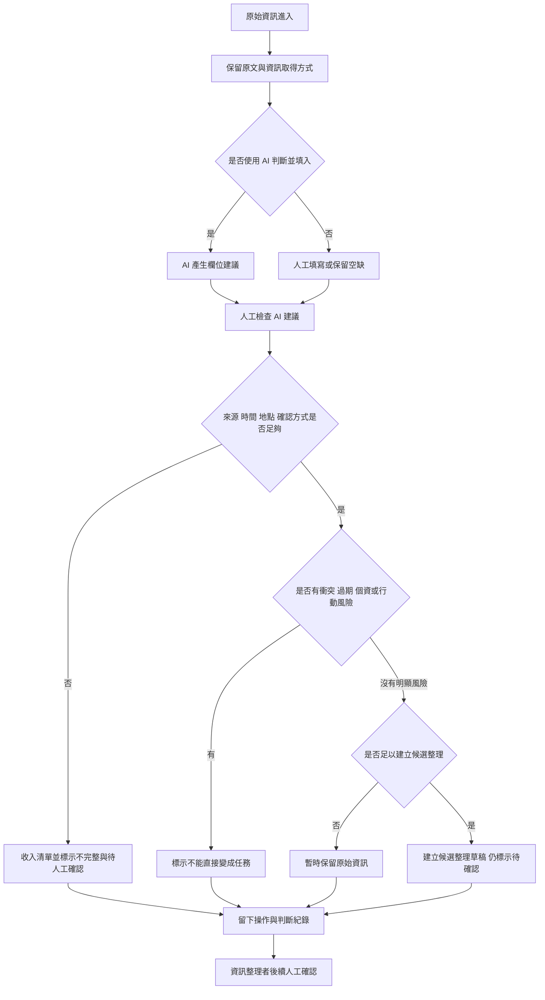

# 資訊流程設計

> 這份文件可以由 Codex 先產生草稿，但你必須用 VS Code 預覽 Mermaid，並由人檢查流程是否合理。

## 我的 v1 目標

請用 2–3 句寫下你現在的 v1 方向。

- 我優先服務的使用者：資訊整理者。
- 這個使用者最想完成的事：把原始資訊先收進工作台，保留原文、來源、時間、地點或範圍、確認方式與判斷紀錄，並分清楚哪些資訊還不能直接使用。
- 我最想避免的錯誤：AI 或畫面把未確認資訊整理得太乾淨，讓後續協作者誤以為已確認或可以直接變成任務。

## 自然語言流程描述

請先用自然語言寫流程，不要一開始就寫 Mermaid。

範例語氣：

```text
原始資訊進來後，資訊整理者先查看來源與原文。
如果資訊不足，標示為需要人工確認。
如果資訊可能誤導行動者，先不要變成候選結果。
如果資訊足夠形成候選結果，建立候選結果，但仍標示為需要人工確認。
每次人工判斷都要留下紀錄。
```

請在下面寫你的流程：

```text
原始資訊進來後，資訊整理者在工作台先保留原文，並補上或檢查來源、時間、地點或範圍、確認方式與備註。
如果使用 AI 判斷並填入，AI 只能產生欄位建議，不能判定資訊為已確認，也不能補真實世界資料。
資訊整理者查看 AI 建議與原文後，先檢查欄位是否足夠。
如果來源、時間、地點或確認方式不足，資訊仍可收入清單，但必須標示為不完整與待人工確認。
如果資訊看起來衝突、過期、涉及個資或可能誤導行動，不能直接變成任務，必須送人工確認或暫時保留。
如果資訊足以形成整理草稿，整理者可以建立候選整理，但仍維持待確認狀態，不顯示成已確認。
每一次 AI 建議、人工採用、人工拒絕、建立候選整理、標示不能處理，都要留下判斷紀錄。
```

## Mermaid 流程圖

請讓 Codex 根據上面的自然語言描述產生 Mermaid。

請用 VS Code 預覽，確認流程圖能正常顯示。



## 人工確認點

請列出流程中哪些地方必須由人判斷。

- AI 自動填入來源、時間、地點或確認方式後，必須由資訊整理者檢查是否採用。
- 資訊是否足以建立候選整理，必須由資訊整理者判斷。
- 出現衝突、過期、個資或行動風險時，必須由人工確認，不可由 AI 自動放行。
- 候選整理是否能進一步交給下一位協作者，也必須保留人工確認。

## 不能自動處理的分支

請列出流程中哪些地方不能讓 AI 自動決定。

- AI 不能自動把資訊標示為已確認。
- AI 不能自動把模糊資訊變成可執行任務。
- AI 不能自動補真實地址、人物、聯絡方式、數量或現場狀態。
- AI 不能自動決定是否派人、是否出發或任務優先順序。
- 資訊不足時不能被強迫轉成候選整理，只能先保留並標示待人工確認。

## 操作或判斷紀錄

請說明哪些動作需要留下紀錄。

- 使用 AI 判斷並填入時，紀錄 AI 填了哪些欄位、哪些欄位仍需人工補選。
- 人工採用或修改 AI 建議時，紀錄採用或修改理由。
- 將資訊標示為不完整、待人工確認、不能直接變成任務或暫時保留時，紀錄原因。
- 建立候選整理草稿時，紀錄它仍是候選，不代表已確認。

## 我檢查後修正了什麼

請寫下你用 `docs/design-checklist.md` 檢查後，至少修正的一件事。

- 原本：流程圖只有「資訊足夠就建立候選結果」，沒有明確處理 AI 建議與人工確認的關係。
- 修正後：加入「AI 產生欄位建議」與「人工檢查 AI 建議」節點，並讓所有輸出都先進入操作與判斷紀錄。
- 為什麼：檢查表要求不能讓 AI 自動決定真偽，也要留下操作或判斷紀錄。

- 原本：自然語言流程提到「回報者或整理者補欄位」，容易讓 v1 主要使用者變得不清楚。
- 修正後：改成「資訊整理者在工作台先保留原文，並補上或檢查欄位」。
- 為什麼：`decisions.md` 已選定 v1 優先服務資訊整理者，流程不應同時試圖服務所有人。

## 流程確認結果

- 已確認：流程從原始資訊開始，且保留原文與資訊取得方式。
- 已確認：AI 只產生欄位建議，後面接人工檢查，不是最終決策者。
- 已確認：資訊不足、衝突、過期、個資或行動風險都會進入待人工確認或不能直接處理分支。
- 已確認：候選整理草稿仍標示待確認，不會被顯示為已確認。
- 已確認：AI 建議、人工採用或拒絕、標示暫時保留、建立候選草稿都會留下操作或判斷紀錄。
- 仍需人類用 VS Code 預覽確認：Mermaid 圖在本機預覽能正常顯示，且小隊同意這條流程足以支撐後續實作。

## 我仍不確定的流程點

請列出目前還需要後續驗證或訪談的地方。

- 資訊整理者看到「候選整理草稿」時，是否會真的理解它還不是已確認資料。
- 回報者如果看到「不完整與待人工確認」，是否會覺得自己的回報失敗。
- 哪些欄位缺漏時仍可收入清單，哪些欄位缺漏時應該暫時不採用，還需要小隊確認。
